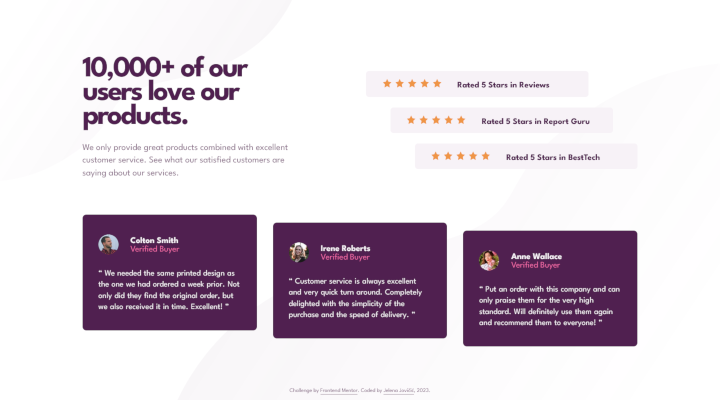

# Frontend Mentor - Social proof section solution

This is a solution to the [Social proof section challenge on Frontend Mentor](https://www.frontendmentor.io/challenges/social-proof-section-6e0qTv_bA). Frontend Mentor challenges help you improve your coding skills by building realistic projects. 

## Table of contents

- [Overview](#overview)
  - [Description](#description)
  - [Screenshot](#screenshot)
  - [Links](#links)
- [My process](#my-process)
  - [Built with](#built-with)
  - [Observations](#observations)
  - [Useful resources](#useful-resources)
- [Author](#author)
- [Acknowledgments](#acknowledgments)

## Overview

### Description

Users should be able to:

- [] View the optimal layout for the section depending on their device's screen size

### Screenshot

  

### Links

- [Solution](...)
- [Live](https://je-jo.github.io/social-proof-section/)

## My process

### Built with

- Semantic HTML5 markup
- Mobile-first workflow
- Sass (7-in-1 pattern)

### Observations

Just a quick easy project to get back after break.

### Useful resources

- [google web fonts helper](https://gwfh.mranftl.com/fonts) - A Hassle-Free Way to Self-Host Google Fonts.
- [7-1 pattern boilerplate](https://github.com/KittyGiraudel/sass-boilerplate/tree/master/stylesheets) - A boilerplate for 7-1 Sass Architecture.
- [HTML / Sass Jumpstart]() - Mostly plucked some sensible values (font sizes, spacings, buttons, etc) from here and a reset file.
- [Fluid typography calculator](https://royalfig.github.io/fluid-typography-calculator/)
- [PerfectPixel](https://www.welldonecode.com/perfectpixel/) a Chrome extension for comparing website with design image.

## Author

- [Github](https://github.com/je-jo)
- [LinkedIn](https://www.linkedin.com/in/jelena-jovicic/)
- [Frontend Mentor](https://www.frontendmentor.io/profile/je-jo)
- [Codepen](https://codepen.io/je-jo)
- [Twitter](https://twitter.com/jelena_jo_)

